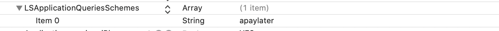

# AtomeMerchantDemo-iOS
Atome Merchant iOS Demo 

## Integration

#### CocoaPods (iOS 10+)

You can use [CocoaPods](http://cocoapods.org/) to install `AtomeSDK` by adding it to your `Podfile`:

```ruby
platform :ios, '10.0'
use_frameworks!

target 'YourApp' do
    pod 'AtomeSDK'
end
```

**add "Queried URL Schemes" to your info.plist, type is "Array",add a string value "apaylater"**

eg.



## Usage
Swift
```swift
// open an atome link to open atome app
AtomeManager.shared().handPaymentURL(url)
```

```swift
if AtomeManager.shared().isAtomeInstalled() {
    debugPrint("Atome already installed")
} else {
    debugPrint("Atome not installed, please go to download")
}
```
Objective-C
```
// open an atome link to open atome app
[[AtomeManager sharedManager] handPaymentURL:url options:nil completionHandler:nil];
```

```
if ([[AtomeManager sharedManager] isAtomeInstalled]) {
    NSLog(@"Atome already installed");
} else {
    NSLog(@"Atome not installed, please go to download");
}
```


## Note

if your project is written by Objective-C, please create Bridging-Header.h
