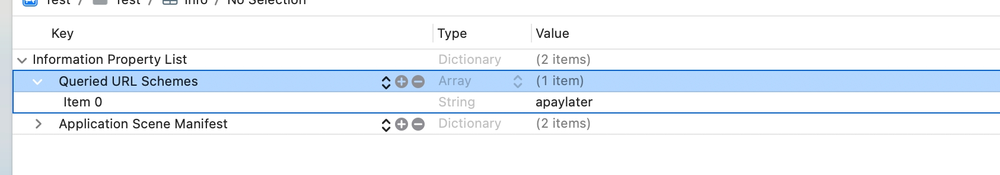

# AtomeMerchantDemo-iOS
Atome Merchant iOS Demo 

## Integration

#### CocoaPods (iOS 10+)

You can use [CocoaPods](http://cocoapods.org/) to install `AtomeSDK` by adding it to your `Podfile`:

```ruby
platform :ios, '10.0'
use_frameworks!

target 'YourApp' do
    pod 'AtomeSDK'
end
```

**add Key:"Localization native development region" to your info.plist, type is "Array",add a string value "apaylater"**

eg.



## Usage
Swift
```swift
// open an atome link to open atome app
AtomeManager.shared().handPaymentURL(url)
```

```swift
if AtomeManager.shared().isAtomeInstalled() {
    debugPrint("Atome already installed")
} else {
    debugPrint("Atome not installed, please go to download")
}
```
Objective-C
```
// open an atome link to open atome app
[[AtomeManager sharedManager] handPaymentURL:url options:nil completionHandler:nil];
```

```
if ([[AtomeManager sharedManager] isAtomeInstalled]) {
    NSLog(@"Atome already installed");
} else {
    NSLog(@"Atome not installed, please go to download");
}
```


## Note

if your project is written by Objective-C, please create Bridging-Header.h

## For Xcode15+ and Mac M1 clip Support 
If you using xcode 15+ and build on iOS-simulator get error like this:
```
Building for 'iOS-simulator', but linking in object file (/Users/byh/Downloads/AtomeMerchantDemo-iOS-master/AtomeMerchantDemo/AtomeSDK.framework/AtomeSDK[arm64][3](AtomeManager-d5b22ad3e5f1ecf00a2425921f392fa3.o)) built for 'iOS'
```

you should add the config as shown in the picture.


and add the code:
```
post_install do |pi|
  pi.pods_project.targets.each do |t|
    t.build_configurations.each do |config|
      config.build_settings['IPHONEOS_DEPLOYMENT_TARGET'] = '13.0'
      config.build_settings["EXCLUDED_ARCHS[sdk=iphonesimulator*]"] = "arm64"
      xcconfig_path = config.base_configuration_reference.real_path
      xcconfig = File.read(xcconfig_path)
      xcconfig_mod = xcconfig.gsub(/DT_TOOLCHAIN_DIR/, "TOOLCHAIN_DIR")
      File.open(xcconfig_path, "w") { |file| file << xcconfig_mod }
    end
  end
end

```
to your podfile
